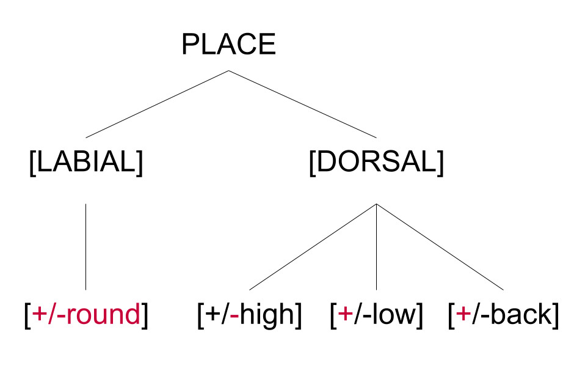
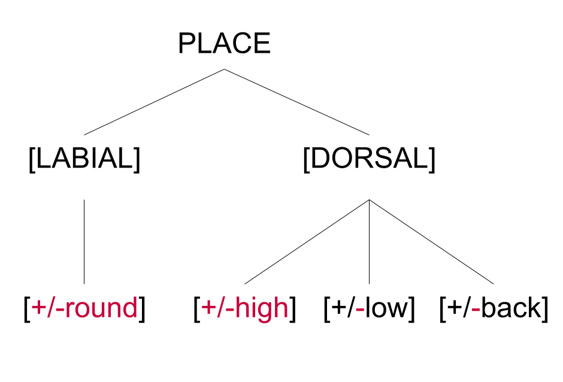
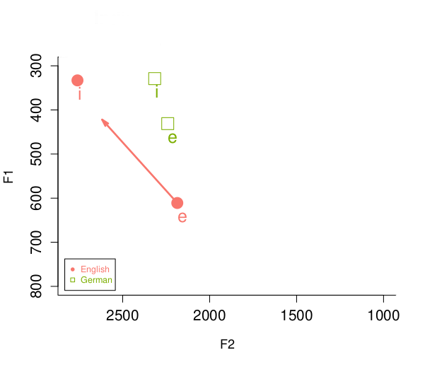

```{r preamble}
library(rstatix)
library(ggplot2)
library(ggpubr)
library(lme4)
library(lmerTest)
library(emmeans)
library(car)
library(optimx)
library(plotrix)
dprimes <- read.csv("dfwithdprime_eng.csv")
dprimes$contrast<-as.factor(dprimes$contrast)
rtdata <- read.csv("discrim_data_clean.csv")
rtdatadiff<-subset(rtdata, trialType=="different")
rtdata$cont<-as.factor(rtdata$cont)
rtdatadiff$cont2<-ifelse(rtdatadiff$cont=="e/i", "/i-e/",
                         ifelse(rtdatadiff$cont=="u/i", "/u-i/",
                                ifelse(rtdatadiff$cont=="u/y", "/u-y/", "/y-i/")))
rtdatadiff$cont2<-as.factor(rtdatadiff$cont2)
ident4<-read.csv("ident_data.csv")
ident4$vowelcontrast<-as.factor(ident4$vowelcontrast)
ident4$vowelcontrast<-relevel(ident4$vowelcontrast, ref = "i/u")
ident4$cont<-ifelse(ident4$vowelcontrast=="i/u", "/u-i/",
                    ifelse(ident4$vowelcontrast=="i/e", "/i-e/",
                           ifelse(ident4$vowelcontrast=="y/u", "/u-y/","/y-i/")))
my_stuff<-read.csv("barplotidentdf.csv")
my_stuff$cont[my_stuff$contrast=="/i-y/"] =  "/y-i/"
```

# Different approaches to L2 phonological acquisition

- The extent to which abstract phonological features are discussed in the L2 phonology literature is [limited/implicit]{style="color:#C70039"}: research focuses on phonetic evidence 
  - Both main frameworks, i.e. SLM/SLM-r (Flege, 1995; Flege & Bohn, 2021) and PAM/PAM-L2 (Best, 1995; Best & Tyler, 2007) do not mention the role of abstract phonological features in L2 acquisition
  - Frameworks that take a formal approach to L2 phonological acquisition have been less explored (e.g. Brown 1998, 2000; Escudero 2005)
    - Does L2 phonological acquisition require operations at an abstract level of representation?
    - What is the relationship between acoustic input and abstract categories?
      
# Features in L2 phonology

What happens at a more abstract level?

- Brown (1998, 2000): L2 learning as L1-mediated access to UG
  - We have no chance to learn features that are no in the L1 grammar
  - BUT: We can reuse existing features from the L1 in order to create new L2 representations. However:
    - If the feature is present but does not lead to contrast by itself, i.e. segments are [**underspecified**]{style="color:#C70039"} (Avery & Rice 1989), it will not be available for the L2
- Archibald (2005, 2009)
    - Features may be "redeployed" from the L1 into the L2, but this is more likely to happen when the perceptual cue is salient
- Hancin-Bhatt (1994): Reusing an L1 feature to form new L2 categories will depend on the feature's [prominence]{style="color:#C70039"}: the more segments are specified for it, the better


# This study: L1 English/L2 German

- L2LP (Escudero 2005): L2 perception can be divided in two different learning tasks
  - [**Representation**]{style="color:#C70039"} task: the learner creates a new category (regardless of the presence/absence of a phonological feature)
  - [**Perceptual**]{style="color:#C70039"} task: the learner assigns different weights to perceptual cues, which allows for boundary shifts to take place
- L1 English/L2 German learners must carry out both tasks:
  - /y ~ u/ contrast: representation (though the features exist; redeployment scenario)
  - /i ~ e/ contrast: perception (contrast exists, features exist, phonetic implementation differs)
  
Will these tasks offer the same degree of difficulty?

# Task 1: Category creation by redeployment

::: {.panel-tabset}

## English

::::::: columns
:::: {.column width="45%"}
- /i-e/ distinction: both long/tense, but /e/ is diphthongized in many varieties: \[e&#618;\]
- System with back unrounded vowels
  - \[round\] needs to be specified in low back segments

::: custom-small
| Feature 1 | Feature 2 | Feature 3 |  \[+/-round\] contrast?|
|-----------|-----------|-----------|-----|
| \[-back\] | \[+high\] |  \[-low\] |no   |
| \[-back\] | \[-high\] |\[-low\] | no    |
| \[-back\] | \[-high\] |\[+low\]  |no    |
| \[+back\] | \[-high\] |\[+low\] |/&#593; \~ &#596;/ |
| \[+back\] | \[-high\] |\[-low\] | no*    |
| \[+back\] | \[+high\] |\[-low\]  |no    |
:::
::::

::: {.column width="10%"}
:::

::: {.column width="45%"}
{fig-align="center"}

- Number of vowel pairs where \[+/-round\] provides contrast: **1**
- In vowel pair /&#652; - o/, \[$\alpha$round\] co-occurs with \[$\alpha$tense\]


:::
:::::::

## German

::::::: columns
:::: {.column width="45%"}
- /i-e/ distinction: both long/tense, but /e/ has low F1 and no diphthongization
- System with front rounded vowels
  - \[round\] needs to be specified in non-low front segments


::: custom-small
| Feature 1    | Feature 2 | Feature 3| \[+/-round\] contrast?  |
|-------------|-----------|----------|-------------|
| \[-back\]| \[+high\] | \[-low\] | /y \~ i/; /ʏ \~ &#618;/ |
| \[-back\]| \[-high\] | \[-low\] |/ e \~ ø/; /ɛ \~ &#339;/ | 
| \[-back\]| \[-high\]  | \[+low\] | -- |
| \[+back\] | \[-high\] | \[+low\] |-- |
| \[+back\] | \[-high\] | \[-low\] |-- |
| \[+back\] | \[+high\] | \[-low\] |-- | 
:::
::::

::: {.column width="10%"}
:::

::: {.column width="45%"}
{fig-align="center"}

- Number of vowel pairs where \[+/-round\] provides contrast: **4**
- Further feature \[+/-tense\] **not redundant** 


:::
:::::::

:::

# Task 2: Boundary shift + monophthongization

:::: {.columns}

:::{.column width="40%"}

- English /e/: diphthongized, lower starting point in articulation
  - Values from female speakers of SSBE (Williams & Escudero 2014)
    - Mean F1: 611 Hz (t1) -  422 Hz (t2)
    - Mean F2: 2186 Hz (t1) - 2618 Hz (t2)

- German /e/: long monophthong, higher articulation point
  - Values from female speakers from Kiel (Pätzold & Simpson 1997)
    - Mean F1: 431 Hz
    - Mean F2: 2241 Hz

:::

::: {.column width="10%"}

:::

:::{.column width="50%"}



:::

::::

# Predictions

- Assuming Brown's view that the [L1 grammar is the limit]{style="color:#C70039"}:
  - Since neither task involve the acquisition of features that are fully absent in the L1 grammar, highly proficient speakers should be able to perform at a native-like level in both cases: /u-i/ ~ /u-y/ ~ /i-e/
- Assuming that [creating a new category is more difficult]{style="color:#C70039"} than shifting a category boundary:
  - We can expect to see that /u-i/ >> /i-e/ >> /u-y/ in terms of performance

# Method

::: {.panel-tabset}

## Participants
  - One group of L1 English speakers of L2 German, self-reported CEFR B2 or above (n = 26)
    - From the UK
    - Required to be fluent in German
  - Recruitment via Prolific

## Stimuli
-   List of words read in carrier sentence ( _Ich sage ... nochmal_ ) by a native speaker of German

::: custom-small

  | /e-i/         | /u-i/      | /u-y/      | /y-i/ |
  |---------------|------------|------------|------------|
  | Segel - Siegel| Tour - Tier| Tour - Tür | Tür - Tier |
  | Leder - Lieder| Spulen - spielen| Spulen - Spülen| Spülen - spielen |
  |               | Stuhl - Stiel | bluten - Blüten | Bühne - Biene|
  
:::

-   The words were spliced and then manipulated in Praat to minimize variations in pitch contour and intensity
  
## Procedure
- Carried out online
  - Hosted in Pavlovia.org
  - Programmed in JavaScript with the jsPsych plugin (de Leeuw et al. 2023)
  - Instructions in German
-   Two perception tasks:
    -   AX discrimination with minimal pairs, contrasts /u – i/ (control), /i – e/ (English and German, with different implementations), /y – i/ and /u – y/ (only German) (ISI = 1500 ms). Number of trials (different and same) = 80
    -   Picture identification task, 2AFC. Number of trials = 78
- Reaction times (RTs) were measured through the participant's keyboard

:::

# Results - discrimination

::: {.panel-tabset}

## Sensitivity (d')

::::{.columns}

::: {.column width="45%"}

```{r dprimestats, include=FALSE}
yesorno<- dprimes %>% friedman_test(dprime ~ contrast |subj)
dprimes %>% friedman_effsize(dprime ~ contrast |subj)
pwc<- dprimes %>% wilcox_test(dprime ~ contrast, paired=TRUE, p.adjust.method = "bonferroni", detailed = T)
```

- Friedman test shows significant differences for d' ($\chi^2$(3)=41.4, p<.001)
  - Kendall's W = 0.53 (effect size: large)
- Post-hoc Wilcoxon shows no difference between /i-e/ and /u-y/

::: custom-small

<table style="text-align:center"><tr><td colspan="6" style="border-bottom: 1px solid black"></td></tr><tr><td style="text-align:left">Cont1</td><td>Cont2</td><td>Est</td><td>Stat</td><td>p adj.</td></tr><tr><td>/i-e/</td><td>/u-i/</td><td>-0.65</td><td>9</td><td><.001</td></tr>
<tr><td>/i-e/</td><td><span style="background-color: #00BFC4">/u-y/</span></td><td>0.29</td><td>202</td><td>.51</td></tr>
<tr><td>/i-e/</td><td>/y-i/</td><td>-1.04</td><td>21</td><td><.001</td></tr>
<tr><td>/u-i/</td><td><span style="background-color: #00BFC4">/u-y/</span></td><td>1.07</td><td>330</td><td><.001</td></tr>
<tr><td>/u-i/</td><td>/y-i/</td><td>-0.15</td><td>99</td><td>.2</td></tr>
<tr><td><span style="background-color: #00BFC4">/u-y/</span></td><td>/y-i/</td><td>-1.34</td><td>19</td><td><.001</td></tr></table>

:::

:::

::: {.column width="10%"}

:::

::: {.column width="45%"}

```{r dprimeplot}
#| fig-width: 5
#| fig-height: 5
#plot
pwc <- pwc %>% add_xy_position(x = "contrast")
p<-ggboxplot(dprimes, x="contrast", y="dprime", add="jitter", color="contrast")+lims(y = c(1, 6.8))+theme(axis.text=element_text(size=15), legend.position = "none", axis.title = element_text(size = 15, face="bold"))+stat_pvalue_manual(pwc[c(1,4,6,3),], label = "p.adj.signif", y.position = c(5.8, 6.1, 6.4, 6.7), tip.length = 0.01)
ggpar(p, xlab = "Contrast", ylab = "Sensitivity (d')")
```

:::

::::

## Reaction times 

::::{.columns}

::: {.column width="45%"}

```{r discrtstats, include=FALSE}
yetanothermodel<-lmer(rt~cont + (1|subject) + (1|stimulus), data=rtdatadiff)
Anova(yetanothermodel)
ph<-emmeans(yetanothermodel, list(pairwise ~  cont))
pares<-pairs(ph)
```
- Linear mixed-effects model with only different trials shows significance for contrast ($\chi^2$=50.88, df=3, p<.001)
  - Emmeans shows significantly different RTs for /u - y/

::: custom-small

| Cont1 | Cont2 | $\beta$ | SE | df | t | p|
|------|-----|----:|----:|----:|----:|---:|
| /e-i/ | /y-i/ | 62.2 | 54.3 | 18 | 1.14 |0.67 |
| /e-i/ | /u-i/ | 120.4 | 54.3 | 18 | 2.22 | 0.16 |
| /e-i/ | <span style="background-color: #00BFC4">/u-y/</span> | -204.7 | 54.4 | 18 | -3.77 | .007|
| /y-i/ | /u-i/ | 58.3 | 48.6 | 18 | 1.20 |0.64 |
| /y-i/ | <span style="background-color: #00BFC4">/u-y/</span> | -266.8 | 48.6 | 18 | -5.49 | 0.002 |
| /u-i/ | <span style="background-color: #00BFC4">/u-y/</span> | -325.1| 48.6 | 18 | -6.69 | <.0001 |

:::

:::

::: {.column width="10%"}

:::

::: {.column width="45%"}

```{r discrtplot}
#| fig-width: 5
#plot
rtplotdisc<-ggplot(rtdatadiff, aes(x=cont2, y=rt, color=cont2)) + geom_jitter(aes(x=cont2, y=rt), colour="grey", width=0.2) + geom_boxplot(outlier.shape = NA, alpha = 0.1) + xlab("Stimuli pair") + ylab("Reaction time (ms)") + theme_classic() +theme(axis.text=element_text(size=15), legend.position = "none", axis.title = element_text(size = 15, face="bold"))+geom_bracket(data=rtdatadiff, aes(x=cont2, y=rt, color=cont2),
    xmin = "/i-e/", xmax = "/u-y/",
    y.position = 3600, label = "**", colour="black", size=0.1,
    tip.length = 0.01)+geom_bracket(data=rtdatadiff, aes(x=cont2, y=rt, color=cont2),
    xmin = "/u-y/", xmax = "/y-i/",
    y.position =  3800, label = "***", colour="black", size=0.1,
    tip.length = 0.01)+geom_bracket(data=rtdatadiff, aes(x=cont2, y=rt, color=cont2),
    xmin = "/u-i/", xmax = "/u-y/",
    y.position = 4000, label = "****", colour="black", size=0.1,
    tip.length = 0.01)
rtplotdisc
```


:::

::::

:::

# Results - identification

::: {.panel-tabset}

## Identification

::::{.columns}

::: {.column width="45%"}

```{r identstats, include=FALSE}
#reg
thisreg<-glmer(correct  ~ cont + (1|subject) + (1|pic_choices), family=binomial, data=ident4)
posthoc<-emmeans(thisreg, list(pairwise ~ cont))
Anova(thisreg)
```
- Mixed-effects binomial regression shows significant differences in correct responses by contrast ($\chi^2$(3)=70.56, p<.001)
  - All contrasts differ significantly from each other, except /u-i/ - /y-i/

::: custom-small

|Cont1 |Cont2 | $\beta$| SE |   z|   p|
|------|------|-------:|---:|---:|---:|
|/i-e/ | /u-i/ | -2.15| 0.53|  -4.01| 0.0003|
|/i-e/ | <span style="background-color: #00BFC4">/u-y/</span> |  1.30| 0.42|   3.14| 0.0094|
|/i-e/ | /y-i/ | -1.56| 0.48|  -3.22| 0.0071|
|/u-i/ | <span style="background-color: #00BFC4">/u-y/</span> |  3.45| 0.49|  7.01| <.0001|
|/u-i/ | /y-i/ |  0.59| 0.55|  1.08| 0.7031|
|<span style="background-color: #00BFC4">/u-y/</span> | /y-i/ | -2.86| 0.44| -6.56| <.0001|

:::

:::

::: {.column width="10%"}

:::

::: {.column width="45%"}

```{r identplot}
#| fig-width: 5
#plot
p2<-ggplot(my_stuff, aes(x=cont, y=allmeans, fill = cont)) +
  geom_bar(stat="identity") + labs(x="Contrast", y = "Correct (prop.)")+ theme_classic(base_size = 15) + theme(legend.position = "none") +
  geom_errorbar(aes(x=cont, ymin=allmeans-margin, ymax=allmeans+margin), width=0.08, colour="black", alpha=0.9, size=1)
p2
```

:::

::::

## Reaction times 

::::{.columns}

::: {.column width="45%"}

```{r, results='hide'}
#reg
rtidentreg<-lmer(rt  ~ cont + (1|subject) + (1|pic_choices), data=ident4)
posthocidrt<-emmeans(rtidentreg, list(pairwise ~ cont))
#Anova(rtidentreg)
```

- Linear mixed-effects model on correct/incorrect responses shows significance for contrast ($\chi^2$=31.04, df=3, p<.001)
  - Emmeans shows significantly different RTs for /u - y/

::: custom-small

|Cont1 |Cont2 | $\beta$| SE | df | t  |   p|
|------|------|-------:|---:|---:|---:|---:|
|/i-e/ | /u-i/ |   58.95| 124.08| 6.99|  0.48| 0.9622|
|/i-e/ | <span style="background-color: #00BFC4">/u-y/</span> | -445.95| 124.10| 7.00| -3.59| 0.0347|
|/i-e/ | /y-i/ |  103.92| 124.08| 6.99|  0.84| 0.8354|
|/u-i/ | <span style="background-color: #00BFC4">/u-y/</span> | -504.90| 111.01| 7.00| -4.55| 0.0109|
|/u-i/ | /y-i/ |   44.97| 110.98| 6.99|  0.41| 0.9758|
|<span style="background-color: #00BFC4">/u-y/</span> | /y-i/ |  549.87| 111.01| 7.00|  4.95| 0.0069|

:::

:::

::: {.column width="10%"}

:::

::: {.column width="45%"}

```{r}
#| output-location: slide
#| fig-width: 5
rtplotident<-ggplot(ident4, aes(x=cont, y=rt, color=cont)) + geom_jitter(aes(x=cont, y=rt), colour="grey", width=0.2) + geom_boxplot(outlier.shape = NA, alpha = 0.1) + xlab("Pic choice") + ylab("Reaction time (ms)") + theme_classic() +theme(axis.text=element_text(size=15), legend.position = "none", axis.title = element_text(size = 15, face="bold"))+geom_bracket(data=ident4, aes(x=cont, y=rt, color=cont),
    xmin = "/u-i/", xmax = "/u-y/",
    y.position = 3600, label = "**", colour="black", size=0.1,
    tip.length = 0.01)+geom_bracket(data=ident4, aes(x=cont, y=rt, color=cont),
    xmin = "/i-e/", xmax = "/u-y/",
    y.position = 4000, label = "*", colour="black", size=0.1,
    tip.length = 0.01)+geom_bracket(data=ident4, aes(x=cont, y=rt, color=cont),
    xmin = "/y-i/", xmax = "/u-y/",
    y.position = 3800, label = "**", colour="black", size=0.1,
    tip.length = 0.01)
rtplotident
```

:::

::::

:::

# Discussion

- In general, /y/ is more likely to be perceptually assimilated to /u/, not /i/
  - "If round, then back"
  - Orthographic effect?
- Discrimination: /u-i/ (native contrast) >> /u-y/, /i-e/
  - Neither feature availability (/u-y/) nor having the same segments with the same features but different implementations (/i-e/) have a facilitatory role in sensitivity
  - Reaction times suggest less hesitation for the /i-e/ contrast ("I am very sure that they are the same")
- Identification: /u-i/ (native contrast) >> /i-e/ >> /u-y/
  - Here we see that having the same segments aids identification, but does not reach the levels seen in the native contrast
  - The representation task involving redeployment is more difficult than changing cue weightings
  - Reaction times again suggest less hesitation for /i-e/

# Summary

- Listeners' sensitivity to target-like distinctions is overall good, but not as good as with native-like contrasts
- When lexical access is required, having the same segments with different phonetic implementations has an advantage over the redeployment scenario
- A representation task involving feature redeployment seems to be a complicated matter: see Barrientos (2024) for results in L1 Spanish/L2 German participants
- Why is it so difficult to perform operations at a more abstract level? Is L2 acquisition a matter of phonetics (i.e. we have no access to rearrange L1 structures)?
- Next steps: participants whose L1 is a language with more contrasts where \[round\] is specified

# References

::: {style="font-size: 50%;"}

1. Archibald, J. (2005). Second Language Phonology as Redeployment of L1 Phonological Knowledge. _Canadian Journal of Linguistics/Revue Canadienne de Linguistique_ 50(1-4), 285-314.
2. Archibald, J. (2009). Phonological feature re-assembly and the importance of phonetic cues. _Second Language Research_ 25(2), 231-233.
3. Best, C. (1995). A direct realist view of cross-language speech research. In Strange, W. (Ed.) _Speech perception and linguistic experience, issues in cross-language research_ (pp.171-204). Timonium, MD: York Press.
4. Best, C. & Tyler, M. (2007). Nonnative and second-language speech perception: Commonalities and complementarities. In M. J. Munro & O.-S. Bohn (Eds.): _Second language speech learning: The role of language experience in speech perception and production_ (pp. 13-34). Amsterdam: John Benjamins.
5. Brown, C. (1998). The role of the L1 grammar in the L2 acquisition of segmental structure. _Second Language Research_ 14(2), 136-193.
6. Brown, C. (2000). The interrelation between speech perception and phonological acquisition from infant to adult. _Second language acquisition and linguistic theory_, 1, 4-64.
7. Darcy, I., Dekydtspotter, L., Sprouse, R. A., Glover, J., Kaden, C., McGuire, M., & Scott, J. H. (2012). _Direct mapping of acoustics to phonology: On the lexical encoding of front rounded vowels in L1 English– L2 French acquisition_. Second Language Research, 28(1), 5-40. https://doi.org/10.1177/0267658311423455
8. Escudero, P. (2005). Escudero, P. (2005). _Linguistic perception and second language acquisition: Explaining the attainment of optimal phonological categorization_. Netherlands Graduate School of Linguistics.
9. Escudero, P. & Boersma, P. (2004). Bridging the gap between L2 speech perception research and phonological theory. _Studies in Second Language Acquisition_ 26, 551–585.
10. Flege, J. E. (1995). Second language speech learning: Theory, findings, and problems . In Strange, W. (Ed.) _Speech perception and linguistic experience: Issues in cross-language research_ (pp. 233-277). Timonium, MD: York Press.
11. Flege, J.E. & Bohn, O. (1997). Perception and production of a new vowel category by adult second language learners. In A. James & J. Leather (Ed.) _Second-Language Speech: Structure and Process_ (pp. 53-74). Berlin, New York: De Gruyter Mouton.
12. Flege, J. E. & Bohn, O-S. (2021). The revised speech learning model (SLM-r). _Second language speech learning: Theoretical and empirical progress_, 3-83.
13. Hancin-Bhatt B (1994) Segment transfer: A consequence of a dynamic system. _Second Language Research_ 10: 241–69.
14. de Leeuw, J.R., Gilbert, R.A., & Luchterhandt, B. (2023). jsPsych: Enabling an open-source collaborative ecosystem of behavioral experiments. _Journal of Open Source Software_ 8(85), 5351, https://joss.theoj.org/papers/10.21105/joss.05351.
15. Pätzold, M., & Simpson, A. P. (1997). Acoustic analysis of German vowels in the Kiel Corpus of Read Speech. _Arbeitsberichte des Instituts für Phonetik und digitale Sprachverarbeitung Universität Kiel_ 32, 215-247.
16.  Rice, K. & Avery, P. (1993). Segmental complexity and the structure of inventories. _Toronto Working Papers in Linguistics_ 12(2).
17. Williams, D. & Escudero, P. (2014). A cross-dialectal acoustic comparison of vowels in Northern and Southern British English. _J. Acoust. Soc. Am._ 136 (5): 2751–2761. https://doi.org/10.1121/1.4896471
:::

# Thank you!

- Contact: fernanda.barrientos-contreras@uni-konstanz.de

- Website: fernandabarrientos.cl
